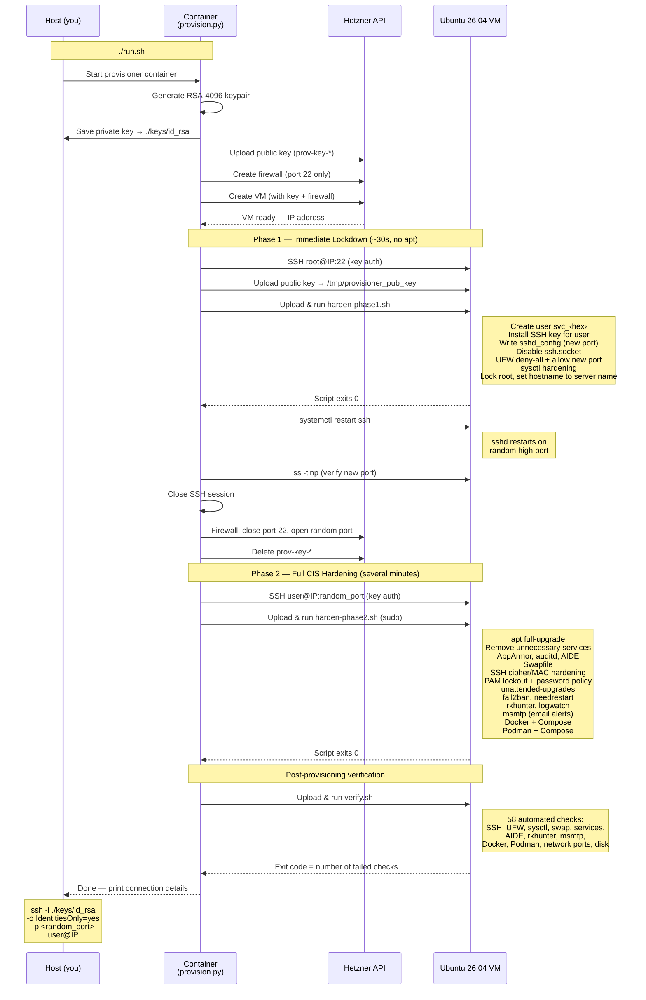
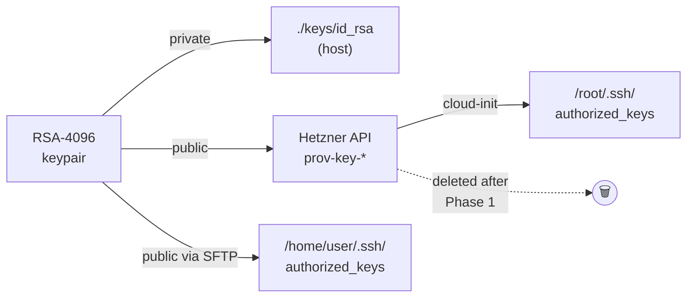

# Portcullis

[](https://github.com/carlok/portcullis/actions/workflows/test.yml)
[](LICENSE)

One command creates a hardened Ubuntu 26.04 VM on Hetzner Cloud. The gate
drops first: SSH and the firewalls are locked down within about 30 seconds.
The full CIS-style hardening pass then runs behind them.

```bash
cp .env.example .env   # set HCLOUD_TOKEN
./run.sh               # provision, harden, verify
```

## Why two phases

A new cloud VM starts with root SSH open on port 22. A typical hardening
script spends several minutes installing packages before it closes that door,
and scanners find new IPs quickly. Portcullis splits the work:

- **Phase 1: lockdown (~30s, no `apt`).** Uses only what the stock image
  already ships. It creates an unprivileged user with key-only SSH on a random
  high port, locks root, enables UFW with default-deny, and applies sysctl
  hardening. The orchestrator then switches the Hetzner Cloud Firewall from
  port 22 to the new port and deletes the temporary API key.
- **Phase 2: full hardening (several minutes).** Reconnects as the new user
  behind both firewalls. It covers package upgrades, AppArmor, auditd, AIDE,
  PAM policy, fail2ban, rkhunter, msmtp alerts, swap, Docker and Podman.
- **Verify.** `verify.sh` runs 58 checks on the finished host and reports
  any failures.

Everything runs inside a Podman container, so nothing is installed on your
machine. A full run takes under 15 minutes.

## Design

- **Python orchestrator.** `provision.py` drives the Hetzner Cloud API and
  both SSH sessions. If provisioning fails partway, it deletes the server, key
  and firewall it created.
- **SSH config in two layers.** Phase 1 owns `sshd_config` (port, key-only
  auth, `AllowUsers`). Phase 2 adds only a drop-in,
  `sshd_config.d/50-cis-hardening.conf`, for ciphers and MACs, so it never
  overwrites access settings.
- **Two firewalls kept aligned.** UFW on the host and the Hetzner Cloud
  Firewall at the network edge both allow only the SSH port.
- **msmtp, not postfix.** A daemonless SMTP client serves as the system MTA,
  so auditd, AIDE, rkhunter and logwatch can send email without a mail server
  running.
- **Container runtimes that work.** Docker and Podman are installed and usable
  by the operator. AppArmor profiles known to break OCI runtimes on 26.04 are
  left disabled.
- **Clean teardown.** `destroy.py` removes a server together with its
  firewalls and leftover provisioning keys.

The default image is `ubuntu-26.04`. You can pick another Ubuntu image with
`OS_IMAGE`, but smoke-test it before using it for real workloads.

---

## Provisioning Flow



### Key flow



---

## How It Works

### Phase 1 — Immediate lockdown (~30 seconds, no package installs)

Runs as root on port 22 immediately after the VM boots. No `apt` is involved —
pure configuration of pre-installed Ubuntu packages.

- Creates a random unprivileged user (`svc_<8hex>`) with key-only SSH access
- Moves SSH to a random high port (10 000 – 60 000); disables root login and
  password authentication entirely; restricts `AllowUsers` to the new account
- Enables UFW with default-deny-incoming; opens only the new SSH port
- TCP wrappers: `/etc/hosts.deny ALL:ALL`, allow only sshd
- sysctl: SYN cookies, reverse-path filtering, IPv6 disabled, ASLR, dmesg
  restrict, source-routing disabled
- Sets the hostname to the full Hetzner server name; disables ctrl-alt-del
  reboot; locks the root account

**As soon as Phase 1 finishes, the Hetzner Cloud Firewall is updated: port 22
is closed and only the new random port is open.**

### Phase 2 — Full CIS hardening (several minutes)

Reconnects as the new user on the new port and runs the full hardening pipeline
via `sudo`.

- `apt full-upgrade` (security + kernel patches), `autoremove`, `clean`
- Removes 20+ unnecessary services (avahi, cups, NFS, Samba, SNMP, …)
- AppArmor (complain mode for ordinary profiles; container runtime profiles
  kept out of complain/enforce mode), auditd with comprehensive ruleset, AIDE file
  integrity (daily cron), rsyslog, journald (persistent), process accounting
- Kernel module blacklisting (cramfs, usb-storage, dccp, sctp, …); secure
  tmpfs mounts for `/tmp`, `/dev/shm`, `/var/tmp`
- 4G swapfile with `vm.swappiness=10`, created before the AIDE baseline
- Vim leaves mouse selection to the terminal emulator, so remote terminal
  copy/paste works normally; users can opt into Vim mouse support themselves
- SSH drop-in at `/etc/ssh/sshd_config.d/50-cis-hardening.conf`: cipher/MAC
  hardening, verbose logging — **does not overwrite Phase 1 settings**
- PAM: faillock (4 attempts, 15 min lock), pwquality (14-char min),
  SHA-512 hashing, password history (last 5), 30-min session timeout
- fail2ban (SSH protection), needrestart (auto-restart services after upgrades)
- rkhunter baseline + nightly scan (03:30 cron)
- logwatch daily digest (via msmtp if SMTP is configured)
- **msmtp** — lightweight SMTP client wired as system MTA (no postfix daemon);
  lets auditd, AIDE, rkhunter, logwatch send email alerts
- Docker Engine from Docker's official apt repository, with Buildx and the
  Docker Compose plugin; the provisioned user is added to the `docker` group
  for non-sudo Docker use
- Podman rootless runtime and `podman-compose` for the provisioned user

> **Docker note:** membership in the `docker` group is effectively
> root-equivalent. It is enabled here because the provisioned user is the
> intended operator account and the workflow expects non-sudo Docker access.

---

## CIS Benchmark Coverage

Both phases combined implement the following controls from
[CIS Ubuntu Linux Benchmark](https://www.cisecurity.org/benchmark/ubuntu_linux)
guidance:

| # | CIS Section | Level | Phase | Status |
|---|---|---|---|---|
| 1.1 | Filesystem module blacklisting (cramfs, freevxfs, hfs, usb-storage, …) | L1 | 2 | ✅ Implemented |
| 1.2 | Package updates (`full-upgrade`, autoremove, GRUB permissions) | L1 | 2 | ✅ Implemented |
| 1.3 | AppArmor (complain mode for ordinary profiles), ASLR, ptrace scope | L1 | 2 | ✅ Implemented |
| 1.4 | Core dump hardening (limits.conf, suid_dumpable) | L1 | 1+2 | ✅ Implemented |
| 1.5 | Remove prelink/apport; unattended-upgrades (security-only) | L1 | 2 | ✅ Implemented |
| 1.6 | Login banner / MOTD hardening | L1 | 1+2 | ✅ Implemented |
| 1.7 | Remove GUI (GDM3) | L1 | 2 | ✅ Implemented |
| 1.8 | Secure tmpfs mounts (`/tmp`, `/dev/shm`, `/var/tmp` — noexec) | L1 | 2 | ✅ Implemented |
| 2.1 | Remove unnecessary services (avahi, cups, NFS, Samba, SNMP, …) | L1 | 2 | ✅ Implemented |
| 2.4 | NTP via systemd-timesyncd (chrony removed) | L1 | 2 | ✅ Implemented |
| 2.5 | Cron permissions (root only) | L1 | 2 | ✅ Implemented |
| 3.1 | Disable IPv6, remove Bluetooth | L1 | 1+2 | ✅ Implemented |
| 3.2 | Disable unused network protocols (DCCP, TIPC, RDS, SCTP) | L2 | 2 | ✅ Implemented |
| 3.3 | Network sysctl hardening (rp_filter, SYN cookies, redirects, source routing) | L1 | 1+2 | ✅ Implemented |
| 4.1 | Host firewall — UFW default-deny, SSH-only | L1 | 1+2 | ✅ Implemented |
| 5.1 | SSH hardening — key-only, no root, random port, cipher/MAC hardening | L1 | 1+2 | ✅ Implemented |
| 5.2 | sudo hardening (logging, use_pty, env_reset) | L1 | 2 | ✅ Implemented |
| 5.4 | Password policy (SHA-512, 180-day max, 14-char min, faillock, pwhistory) | L1 | 2 | ✅ Implemented |
| 6.1 | auditd with comprehensive ruleset (time, user/group, priv esc, modules, …) | L2 | 2 | ✅ Implemented |
| 6.2 | rsyslog (auth logging, emergency broadcast) | L1 | 2 | ✅ Implemented |
| 6.3 | journald (persistent storage), log rotation | L1 | 2 | ✅ Implemented |
| 6.4 | Process accounting (acct) | L2 | 2 | ✅ Implemented |
| 6.5 | AIDE file integrity monitoring (daily cron) | L1 | 2 | ✅ Implemented |
| 7.1 | Critical file permissions (`/etc/passwd`, `/etc/shadow`, …) | L1 | 2 | ✅ Implemented |
| 7.2 | Log file permissions (640/750) | L1 | 2 | ✅ Implemented |

**Beyond CIS** — additional hardening not in the benchmark:

| # | Control | Phase |
|---|---|---|
| 8.1 | fail2ban (SSH brute-force protection) | 2 |
| 8.2 | msmtp (lightweight MTA for security alerts) | 2 |
| 8.3 | logwatch (daily security digest) | 2 |
| 8.4 | needrestart (auto-restart services after upgrades) | 2 |
| 8.5 | rkhunter (rootkit detection, nightly scan) | 2 |
| 8.6 | Docker + Compose, Podman + Compose container runtimes | 2 |
| 1.9 | 4G swapfile (operational resilience for small VMs) | 2 |
| — | Hetzner Cloud Firewall (network-level port control) | 1 |
| — | TCP wrappers (`hosts.deny ALL:ALL`) | 1 |
| — | OS hostname aligned to the generated Hetzner server name | 1 |
| — | ctrl-alt-del reboot disabled | 1 |
| — | Root account locked | 1 |
| — | `ssh.socket` disabled (prevents port override) | 1 |

**Not implemented** (not applicable to Hetzner Cloud VMs):

| Control | Reason |
|---|---|
| GRUB password | No physical/console access — cloud VMs boot unattended |
| Separate partitions (`/var`, `/var/log`, `/home`) | Single-disk cloud instances; not practical without custom images |
| Wireless/WLAN hardening | No wireless interface on cloud VMs |
| SELinux | Ubuntu uses AppArmor as its default MAC framework |

---

## Usage

### 1. Configure `.env`

```bash
cp .env.example .env
nano .env          # fill in HCLOUD_TOKEN at minimum
```

Optional settings: region, server type, a fixed username, and SMTP credentials
for email alerts (auditd, AIDE, rkhunter, logwatch all use the same MTA).

### Availability polling

The standalone `availability/poll.py` script checks the configured server types
against Hetzner's current per-location availability indicator and emails the
matching types using the SMTP settings above. It does not create a server, and
availability is only an indicator rather than a guarantee that creation will
succeed.

Set `POLL_SERVER_TYPES` to a comma-separated list such as
`cx22,cx23,cx33`, set `POLL_LOCATION` to one or more comma-separated locations
(default `fsn1`), and run it from a host
Python environment with the project dependencies installed:

```bash
python3 -m venv .venv
.venv/bin/pip install -r requirements.txt
.venv/bin/python availability/poll.py
```

For a daily cron job, copy `availability/cron.example`, replace its two
absolute paths, and add the resulting line with `crontab -e`. The poller sends
one email on each run where at least one configured type is reported available;
it stays quiet when all configured types are unavailable.

### 2. Build and provision

```bash
chmod +x run.sh
./run.sh
```

The script builds the container image and runs the provisioner. Your private key
is saved to `./keys/id_rsa` on the host. A full log is saved to
`./logs/provision-<timestamp>.log`.

Before creating a VM, you can validate the local configuration without creating
any Hetzner resources:

```bash
./run.sh preflight
```

### 3. Connect

```
PROVISIONING COMPLETE
Server IP  : 1.2.3.4
SSH Port   : 48123
Username   : svc_a1b2c3d4
Private Key: /workspace/id_rsa  (mounted at ./keys/id_rsa on your host)

Connect with:
  ssh -i ./keys/id_rsa -o IdentitiesOnly=yes -p 48123 svc_a1b2c3d4@1.2.3.4
```

> **Tip:** `-o IdentitiesOnly=yes` is important if your SSH agent has multiple
> keys loaded — without it, the agent offers all keys first and `MaxAuthTries 3`
> rejects you before the correct key is tried.

### Destroy a VM

To tear down a server and all associated Hetzner resources:

```bash
./run.sh destroy hardened-node-a1b2c3          # interactive confirm
./run.sh destroy hardened-node-a1b2c3 --yes    # non-interactive (CI)
./run.sh destroy 1.2.3.4                       # find by IP instead
```

This deletes: the server (releasing its primary IPv4/IPv6), attached firewalls,
and any orphaned `prov-key-*` SSH keys left from provisioning.
Floating IPs are listed as a warning but **not** auto-deleted.

---

## Testing

Unit tests and code coverage run entirely inside a dedicated container stage —
nothing is installed on the host.

```bash
./run.sh test
```

This builds the `test` stage of the Dockerfile (extends the production image,
adds `shellcheck`, `pytest`, and `pytest-cov`), checks shell scripts, runs all
tests, and prints a coverage report. The build fails if coverage drops below
60 %.

```
tests/test_provision.py          — key generation, logging, SFTP upload,
                                   remote execution, SSH wait, firewall lockdown
tests/test_destroy.py            — server, firewall, key and floating-IP lookup
tests/test_preflight.py          — .env validation
tests/test_availability_poll.py  — server-type availability poller
tests/test_phase2_defaults.py    — Phase 2 default policy checks
```

The same checks run in GitHub Actions on every push and pull request.

Functions that require live Hetzner API access (`main()`, `destroy()`) are
integration concerns and are not unit tested here.

---

## Configuration reference

| Variable | Default | Description |
|---|---|---|
| `HCLOUD_TOKEN` | — | **Required.** Hetzner Cloud API token |
| `SERVER_NAME` | `hardened-node` | Name prefix — actual Hetzner name and OS hostname are `<prefix>-<6hex>` |
| `SERVER_TYPE` | `cx22` | Hetzner server type |
| `LOCATION` | `fsn1` | Hetzner datacenter location |
| `OS_IMAGE` | `ubuntu-26.04` | Base OS image |
| `NEW_USER_NAME` | _(random)_ | Override the provisioned username |
| `SMTP_HOST` | — | SMTP relay hostname (enables msmtp + email alerts) |
| `SMTP_PORT` | `587` | SMTP port (STARTTLS) |
| `SMTP_USER` | — | SMTP username |
| `SMTP_PASS` | — | SMTP password |
| `SMTP_FROM` | — | Sender address |
| `ALERT_EMAIL` | — | Recipient for security digests |
| `POLL_SERVER_TYPES` | `cx22,cx23,cx33` | Comma-separated server types checked by the availability poller |
| `POLL_LOCATION` | `fsn1` | Comma-separated locations checked by the availability poller |

---

## Files

| File | Purpose |
|---|---|
| `provision.py` | Orchestrator — Phase 1 → firewall lockdown → Phase 2 → verify |
| `destroy.py` | Tear down a server and its Hetzner resources |
| `harden-phase1.sh` | Phase 1 script (immediate lockdown, no apt) |
| `harden-phase2.sh` | Phase 2 script (full CIS pipeline) |
| `verify.sh` | Post-provisioning health check — 58 automated checks (SSH, UFW, sysctl, swap, services, AIDE, rkhunter, msmtp, Docker, Podman, network ports, disk) |
| `preflight.py` | Validate `.env` before creating any resources |
| `Dockerfile` | Container image for the provisioner (`prod` and `test` stages) |
| `run.sh` | Wrapper: provision, `preflight`, `destroy`, `test` |
| `availability/poll.py` | Daily-check script for reported Hetzner server-type availability |
| `availability/cron.example` | Example daily cron entry for the availability poller |
| `logs/` | Host-side logs — `<mode>-<timestamp>.log` for each run |
| `tests/` | Unit tests (pytest) |
| `.env.example` | Configuration template |

---

## Origins

Portcullis started in March 2026 from a fork of
[AndyHS-506/Ubuntu-Hardening](https://github.com/AndyHS-506/Ubuntu-Hardening),
a single-pass CIS hardening script for Ubuntu 24.04. The original script was
dropped early on. The two-phase design, orchestrator, tests and tooling were
all written later. The CIS-style section numbering in `harden-phase2.sh` is
kept for auditability.

## License

[MIT](LICENSE)
